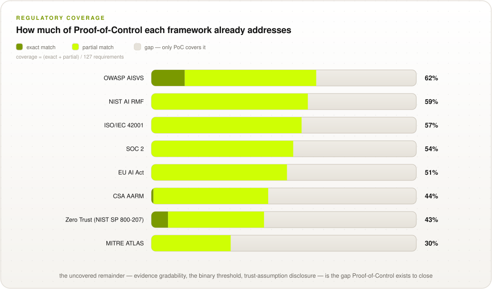

<p align="center">
  <picture>
    <source media="(prefers-color-scheme: dark)" srcset="images/poc-banner-dark.svg">
    <source media="(prefers-color-scheme: light)" srcset="images/poc-banner-light.svg">
    
  </picture>
</p>

<p align="center">
  <a href="https://www.apache.org/licenses/LICENSE-2.0"></a>
  <a href="0.1/en/0x01-Frontispiece.md"></a>
  <a href="0.1/en"></a>
  <a href="https://advancedaisociety.org/"></a>
</p>

> **Launch of v1.0** — comment on the
> [Google Doc](https://docs.google.com/document/d/1EiiGDwLXvMxoSHp3Ru56AhR2u9gNd-6Fjs_CKZ4kU-w/edit?tab=t.0#heading=h.5cwdygy69mua)
> or in this GitHub.

> **Get involved:** Proof-of-Control is developed in the open and stewarded by the
> **[Advanced AI Society](https://advancedaisociety.org/)**. Join a working group, comment on
> the draft, or become a member — **[sign up at advancedaisociety.org](https://advancedaisociety.org/)**.

## What is Proof-of-Control?

The **Proof-of-Control Standard** is a catalogue of verifiable requirements for AI agent systems: open, tamper-evident evidence of what an agent actually did — the data it touched, the authority it exercised, the tools it invoked — in a form anyone can verify **without trusting the operator**. Every requirement follows the same philosophy as [OWASP AISVS/ASVS](https://github.com/OWASP/AISVS): **verifiable, testable, and implementable**.

A system has Proof-of-Control when, and only when, its evidence reaches **Tier 3 or Tier 4** of the Verifiability Tiers — a binary threshold that makes the category procurable: *"Does your AI have Proof-of-Control?"* is a yes-or-no question.

> **New to the standard? Start with the one-pager:** [**The Smart Leash**](docs/one-pager.md) —
> the whole standard in one analogy: from *"trust me"* to *"trust my auditor"* to *"trust the
> math"* to *the leash locks itself*.

## The Standard at a Glance

<p align="center">
  <picture>
    <source media="(prefers-color-scheme: dark)" srcset="images/diagrams/standard-at-a-glance-dark.svg">
    
  </picture>
</p>

## The Binary Threshold

Evidence is graded by **who you must trust to believe it**. Cryptography alone does not raise the tier — removing the trusted party does.

<p align="center">
  <picture>
    <source media="(prefers-color-scheme: dark)" srcset="images/diagrams/tier-ladder-dark.svg">
    
  </picture>
</p>

| Tier | Name | Who you must trust | Proof-of-Control? |
| :---: | --- | --- | :---: |
| 4 | Self-Enforcing | The protocol itself: continuous constraints, anchored in external hardware roots of trust | **Yes** |
| 3 | Trust-minimized | The mechanism's soundness, and the parties it depends on, as disclosed | **Yes** |
| 2 | Attestation | A third party or qualified auditor | No |
| 1 | Assertion | The operator | No |

## Requirement Chapters

Chapters **C1–C6** are the six domains of verification — *what* must be verified. Chapters **C7–C10** are cross-cutting — what the evidence must *be*, how it is *graded*, *where* it applies, and how claims are *checked*.

| Chapter | Verifiable facts / scope |
| --- | --- |
| [C1: Provenance](0.1/en/0x10-C01-Provenance.md) | Which model ran; lineage, artifact and supply-chain origin |
| [C2: Privacy](0.1/en/0x10-C02-Privacy.md) | What data was read and written — evidenced without re-leaking it |
| [C3: Portability](0.1/en/0x10-C03-Portability.md) | Boundary crossings: organizational, jurisdictional, compute |
| [C4: Authorization](0.1/en/0x10-C04-Authorization.md) | Authority granted, decisions within or against it, delegation validity |
| [C5: Identity](0.1/en/0x10-C05-Identity.md) | Which agent and which principal ran |
| [C6: Security](0.1/en/0x10-C06-Security.md) | Execution-environment integrity; controls held; tools invoked; key lifecycle |
| [C7: Evidence Generation & Properties](0.1/en/0x10-C07-Evidence-Generation-and-Properties.md) | Interception gateways; the four properties; determinism boundary; custody & resilience |
| [C8: Verifiability Tiers & Binary Threshold](0.1/en/0x10-C08-Verifiability-Tiers.md) | Tier placement, mechanism fit, chain integrity |
| [C9: System Surface (MAESTRO)](0.1/en/0x10-C09-System-Surface-MAESTRO.md) | Locating evidence on the 7-layer agent stack |
| [C10: Conformance & Disclosure](0.1/en/0x10-C10-Conformance-and-Disclosure.md) | Stages, scope declaration, trust-assumption disclosure |

### Appendices

| Appendix | Contents |
| --- | --- |
| [A: Glossary](0.1/en/0x90-Appendix-A_Glossary.md) | Normative terms and the Tier/Stage/Layer/Phase naming discipline |
| [B: Proof-Mechanism & Controls Inventory](0.1/en/0x91-Appendix-B_Proof-Mechanism-Inventory.md) | The 9-mechanism taxonomy and all seven MAESTRO layer control tables |
| [C: Threat Model](0.1/en/0x92-Appendix-C_Threat-Model.md) | 32 threats: coverage grades and out-of-scope boundaries |
| [D: Open Working-Group Issues](0.1/en/0x93-Appendix-D_Open-Issues.md) | Every `[WG-INPUT NEEDED]` decision, collected |
| [E: Audit Checklist](0.1/en/0x94-Appendix-E_Audit-Checklist.md) | All 127 requirements as tickable task lists, with the coverage matrix — generated, never stale |

## Reference Implementation

A working implementation of the evidence pipeline — interception, path-aware policy, signed hash
chain, capability-bound dispatch, anchoring, gossip, and open verification — with an
attack harness and benchmarks: [`impl/`](impl/README.md).

```bash
cd impl
python3 tests/test_core.py        # 22 correctness tests, mapped to requirement IDs
python3 attacks/run_attacks.py    # 11 attacks, run with and without each requirement
python3 bench/bench.py            # latency, scaling, verification, utility
python3 bench/bench_pq.py         # post-quantum signature comparison
python3 bench/bench_frontier.py   # the declassification frontier
python3 bench/bench_ops.py        # scaling, anchoring interval, batching, retention
python3 bench/bench_merkle.py     # inclusion and consistency proofs vs chain replay

cd ..
python3 schema/validate.py --vectors   # the published evidence test vectors
python3 schema/cbor_profile.py         # JSON <-> CBOR rendering equivalence
```

**Now measured on real Intel TDX hardware** ([`impl/tdx/`](impl/tdx)): running inside a trust
domain costs **6.2%** (9.45 us/step), but a single hardware quote costs **39.5 ms** - 2.6x the
entire 15 ms per-action budget, so per-action attestation is impossible and every deployment
must amortize. That amortization is a new exposure window, now requirement **C7.2.3**. The
evidence key is cryptographically bound into the quote's `REPORTDATA` (**C7.2.4**).

Headline results (Apple M2 Max, single core; except where noted the TEE is modelled in-process,
so enclave transitions are excluded and latencies are a lower bound): **201 µs** per intercepted step
(p99 255 µs) — **1.3%** of the 15 ms design budget · path-aware evaluation **flat at 0.21 µs**
from 10 to 50,000 steps, versus linear growth for naive re-evaluation · **11/11 attacks** succeed
without the derived requirements and are refused or detected with them · a Merkle inclusion
proof checks one record in a 100,000-record log with **544 bytes** instead of replaying
**123 MB** · path-aware authorization falsely rejects **42%** of benign workflows without a
declassification point — and the fix is not more coverage but *verifiable* declassification,
which takes false rejections to 0% while raising detection to 100%.

Several requirements in this standard exist because building or reviewing the implementation
found defects the prose missed — **C7.3.5** (an anchor's *root* must be compared, not only its
step count) and the two found by the [round-3 cross-model
review](docs/reviews/paper-review-round3-crossmodel.md): a binding check that failed open when
unconfigured, and a capability that was never cross-bound to its evidence record. See attacks
A9–A11.

### The evidence claim set, in machine-readable form

Prose and a field table are not enough to make two implementations agree. Two implementations
that serialize the same action differently produce different digests for it — every signature
still verifies, so nothing looks broken, and the binding property that Theorem 1 depends on
fails silently. [`schema/`](schema/README.md) closes that: CDDL for the CWT/CBOR rendering,
JSON Schema for the JWT rendering, a canonicalization specification stating exactly which bytes
a signature covers, and **16 signed test vectors** — four positive, ten negative, two
canonical-form. The reference implementation's own output is validated against the schema in its
test suite, so the two cannot drift apart silently.

### Running an audit

The whole standard is available as a working checklist, in whichever form your audit runs on:

| Representation | Where | Use it for |
| --- | --- | --- |
| Tickable task lists | [Appendix E](0.1/en/0x94-Appendix-E_Audit-Checklist.md) | Working an audit directly on GitHub, or copying into issues/tickets |
| Coverage matrix | [Appendix E](0.1/en/0x94-Appendix-E_Audit-Checklist.md#coverage-matrix) | Scoping: chapters × levels at a glance |
| CSV export | [`checklist/poc-checklist.csv`](checklist/poc-checklist.csv) | Spreadsheet-driven audits — includes empty `status` and `auditor_notes` columns |
| JSON export | [`checklist/poc-checklist.json`](checklist/poc-checklist.json) | GRC tooling and automation |
| Auditor evidence notes | Every chapter section | What to collect and what to test, per requirement ID |

All of these are generated from the chapters by [`tools/generate_checklist.py`](tools/generate_checklist.py), so they cannot drift from the normative text.

## Requirement Levels

Each requirement carries a level (1–4), **aligned one-to-one with the Verifiability Tiers**: meeting the Level-N requirements is what makes evidence gradable at Tier N. Levels are cumulative, and every section ends with **"Auditor evidence"** guidance — what to collect and what to test, per requirement ID — so a compliance lead can scope an audit directly from the chapters.

| Level | Name | Aligned Tier | What it means |
| :---: | --- | :---: | --- |
| **1** | Recorded | Tier 1 | The control operates and its evidence is captured in queryable records — the on-ramp |
| **2** | Attested | Tier 2 | Evidence is signed, hash-chained, or attested; an assessor can confirm it unaltered |
| **3** | Trust-minimized | Tier 3 | Mechanism-generated evidence, verifiable by outsiders with published tooling — **the binary threshold; minimum for a Proof-of-Control claim** |
| **4** | Self-Enforcing / Continuous | Tier 4 | Verification gates operation: full coverage, fail-closed, Continuously Monitored |

## How a Claim Gets Checked

<p align="center">
  <picture>
    <source media="(prefers-color-scheme: dark)" srcset="images/diagrams/conformance-stages-dark.svg">
    
  </picture>
</p>

What a claim is worth comes from the **domains** claimed (C1–C6), the **Tier** of each claim (C8), the **conformance stage** (C10), and the **trust-assumption disclosure** — the part that lets two conformant systems be priced differently.

## Project Leadership

The standard is led by co-chairs **Ken Huang** and **Tricia Wang**, produced by the Proof-of-Control Initiative's working groups, reviewed by a Distinguished Review Board, and stewarded by the [Advanced AI Society](https://advancedaisociety.org/) as a public good ([Governance](docs/governance.md)). The Proof-of-Control Lab is being established as a community lab at Linux Foundation Decentralized Trust.

### What Proof-of-Control is NOT

* **Not validation.** Proof-of-Control shows an agent stayed inside the control boundaries that were set; whether those boundaries — or the outputs — were *right* stays a human judgment ([C7.5](0.1/en/0x10-C07-Evidence-Generation-and-Properties.md)).
* **Not a governance or risk framework.** [NIST AI RMF](https://www.nist.gov/itl/ai-risk-management-framework), [ISO/IEC 42001](https://www.iso.org/standard/42001), and the EU AI Act govern; Proof-of-Control produces the evidence that makes their requirements verifiable.
* **Not runtime enforcement.** Enforcement (what an agent *may* do) is CSA AARM's half; Proof-of-Control is the evidence half (what it *did*, verifiable by others).
* **Not tied to any technology or vendor.** The standard defines what the evidence must be, not which mechanism produces it.

## Regulatory Coverage

How much of Proof-of-Control each external framework already addresses — (Exact + Partial
matches) / 127 requirements, coded per the [mapping rubric](mappings/rubric.md) and reproducible
with `python3 mappings/compute_coverage.py`:

<p align="center">
  <picture>
    <source media="(prefers-color-scheme: dark)" srcset="images/diagrams/mapping-coverage-dark.svg">
    
  </picture>
</p>

> **Read the caveat first.** These are single-coder seed estimates with a known upward bias.
> An [independent review](docs/reviews/mapping-review-2026-08.md) of all 1,016 coded rows
> challenged every Exact rating and found 96 citations that name a chapter rather than a
> checkable clause. Treat the direction as informative and the values as provisional.

<!-- BEGIN GENERATED COVERAGE -->

**Coverage = (EM + PM) / 127 requirements.** Only exact and partial matches count; the NM column is the gap only Proof-of-Control fills.

| Framework | Exact (EM) | Partial (PM) | None (NM) | Coverage |
| --- | :---: | :---: | :---: | :---: |
| [OWASP AISVS](mappings/owasp.md) | 16 | 63 | 48 | **62%** |
| [NIST AI RMF](mappings/nist-ai-rmf.md) | 0 | 75 | 52 | **59%** |
| [ISO/IEC 42001](mappings/iso-iec-42001.md) | 0 | 72 | 55 | **57%** |
| [SOC 2](mappings/soc-2.md) | 0 | 68 | 59 | **54%** |
| [EU AI Act](mappings/eu-ai-act.md) | 0 | 65 | 62 | **51%** |
| [CSA AARM](mappings/csa-aarm.md) | 1 | 55 | 71 | **44%** |
| [Zero Trust (NIST SP 800-207)](mappings/zero-trust.md) | 8 | 46 | 73 | **43%** |
| [MITRE ATLAS](mappings/mitre-atlas.md) | 0 | 38 | 89 | **30%** |

<!-- END GENERATED COVERAGE -->

The uncovered remainder — evidence gradability, the binary threshold, trust-assumption
disclosure, self-enforcing execution — is the gap Proof-of-Control exists to close. Full
EM/PM/NM breakdown, row-level [coding sheet](mappings/coding_sheet.csv), and corpus provenance
in [`mappings/`](mappings/README.md). *(Draft seed coding, pending working-group validation.)*

## How Proof-of-Control Complements Other Standards

| Standard | Focus | Proof-of-Control relationship |
| --- | --- | --- |
| [CSA MAESTRO](mappings/maestro.md) | Agent threat modeling (7-layer stack) | Adopted as Proof-of-Control's System surface ([C9](0.1/en/0x10-C09-System-Surface-MAESTRO.md)) |
| [CSA AARM](mappings/csa-aarm.md) | Runtime enforcement at the action boundary | Complementary halves: AARM enforces, Proof-of-Control evidences |
| [OWASP Top 10s / AIVSS / AISVS](mappings/owasp.md) | Agent & LLM threats; AI security controls | Threat source for Proof-of-Control's threat model; Proof-of-Control adds open evidence that the controls held |
| [MITRE ATLAS](mappings/mitre-atlas.md) | Adversarial AI threat catalog | Threat source ([Appendix C](0.1/en/0x92-Appendix-C_Threat-Model.md)) |
| [NIST AI RMF](mappings/nist-ai-rmf.md) | AI risk governance | Proof-of-Control supplies the runtime evidence RMF controls are checked against |
| [ISO/IEC 42001](mappings/iso-iec-42001.md) | AI management systems | Proof-of-Control evidences that declared controls held at execution |
| [SOC 2](mappings/soc-2.md) | Organizational attestation | Proof-of-Control is SOC-2-grade in role, with a cryptographic stage SOC 2 never had |
| [EU AI Act](mappings/eu-ai-act.md) | Regulation | Proof-of-Control evidence lets rules be enforced against evidence, not filings |
| [Zero Trust](mappings/zero-trust.md) · [Confidential Computing](mappings/confidential-computing.md) · [AIUC-1](mappings/aiuc-1.md) | Architecture / mechanism / audit | See all crosswalks in [`mappings/`](mappings/README.md) |

## Repository Layout & Versioning

```text
/
├── 0.1/en/     <- the standard: chapters C1–C10 + appendices A–E  (v1.0)
├── schema/     <- the evidence claim set: CDDL, JSON Schema, canonical form, test vectors
├── impl/       <- reference implementation, attack harness, benchmarks
├── checklist/  <- the audit checklist as CSV and JSON (generated)
├── mappings/   <- framework crosswalks (MAESTRO, OWASP, NIST, SOC 2, EU AI Act, …)
├── paper/      <- the arXiv preprint (LaTeX source and figures)
├── tools/      <- generators: checklist, diagrams, charts, crosswalks, test vectors
├── docs/       <- companion documents: the case for the standard, reviews
├── images/     <- banner, artwork, and generated diagrams
```

Proof-of-Control uses `v<MAJOR>.<MINOR>` versioning; released folders are locked, mirroring [OWASP ASVS](https://github.com/OWASP/ASVS)/[AISVS](https://github.com/OWASP/AISVS) ([RELEASE.md](RELEASE.md)). Version 1.0 is targeted for **February 1, 2027** ([roadmap](docs/roadmap.md)).

**Referencing requirements:** `C<chapter>.<section>.<requirement>`, version-qualified as `v0.1-C4.1.4`:

> Verify that the evaluated payload parameters of each tool invocation matched the exact structural schema authorized at execution time.

## Companion Documents

The case for the standard — informative, no requirements:

[Introduction & design principles](docs/introduction.md) · [Why verification matters](docs/why-verification-matters.md) · [Standards landscape](docs/standards-landscape.md) · [Use cases](docs/use-cases/README.md) · [The Smart Leash one-pager](docs/one-pager.md) · [arXiv preprint draft](paper/README.md) · [Roadmap](docs/roadmap.md) · [Governance](docs/governance.md) · [Research basis](docs/research-basis.md) · [CISO review](docs/reviews/ciso-review-v0.1.4.md) · [Security peer review](docs/reviews/security-venue-review-paper-v0.1.md) · [Round 2](docs/reviews/security-venue-review-round2.md) · [Round 3 (cross-model)](docs/reviews/paper-review-round3-crossmodel.md) · [Mapping review](docs/reviews/mapping-review-2026-08.md)

## Contributing

The repository is public and anyone may propose a change — you do not need to be a member or a
working-group participant to open a pull request. What contribution looks like, and the change
process behind it, is in [CONTRIBUTING.md](CONTRIBUTING.md). The open decisions that most need
input are collected in [Appendix D](0.1/en/0x93-Appendix-D_Open-Issues.md). Weaknesses in the
standard itself belong in a public issue — adversarial review of the binary threshold is
explicitly welcome — but a finding whose disclosure would itself create risk goes privately to
the working group instead ([Security Policy](SECURITY.md)).

**Open an issue before a large pull request.** The standard moves by working-group consensus, so
a substantive change — a new requirement, a retired one, a changed level or tier — is best
started as an issue where it can be discussed before anyone writes it. Typos, broken links,
clarified wording, and crosswalk rows can go straight to a pull request.

### Propose a change with a fork and a pull request

1. **Fork** this repository on GitHub, then clone your fork and add this repository as
   `upstream` so you can keep it current:

   ```bash
   git clone https://github.com/<your-username>/ov-poc-standard.git
   cd ov-poc-standard
   git remote add upstream https://github.com/AAI-Society/ov-poc-standard.git
   ```

2. **Branch** off an up-to-date `master`. Name the branch for the change, not for yourself:

   ```bash
   git fetch upstream
   git checkout -b c4-delegation-depth upstream/master
   ```

3. **Make the change.** Requirements language follows RFC 2119/8174, and the naming discipline
   (Tier / Level / Stage / Layer / Phase) is normative — both are in
   [CONTRIBUTING.md](CONTRIBUTING.md#editorial-conventions). Every requirement must name a
   verifiable artifact or testable behavior, and its section's *Auditor evidence* note must say
   what to collect and what to test.

4. **Regenerate what is generated.** The checklist, crosswalks, and diagrams are built from the
   chapters so they cannot drift from the normative text. If you touched a requirement table or
   a diagram, regenerate and commit the output alongside your change:

   ```bash
   python3 tools/generate_checklist.py     # Appendix E + checklist/ exports
   python3 tools/generate_crosswalks.py    # mappings/ crosswalk tables
   python3 tools/generate_diagrams.py      # images/diagrams/ SVGs
   ```

   On Windows, a stock python.org install registers `python.exe` and the `py` launcher, not
   `python3.exe` — if `python3` isn't found, use `python` or `py -3` instead.

5. **Run the checks that cover what you touched.** There is no CI on pull requests yet, so run
   them locally and say in the PR what you ran. Both need Python 3.11+ and their dependencies —
   install those first, or `validate.py` will report every negative vector as failing for the
   wrong reason rather than telling you a module is missing:

   ```bash
   pip install cryptography jsonschema
   python3 schema/validate.py --vectors    # if you changed schema/ or the claim set
   cd impl && python3 tests/test_core.py   # if you changed the reference implementation
   ```

   Expect `17 passed, 0 failed` and `22 passed, 0 failed`.

6. **Commit and push to your fork**, then open a pull request against `master`:

   ```bash
   git commit -am "Bound delegation depth in C4.3"
   git push -u origin c4-delegation-depth
   ```

   Explain in the description *what changes and why it is verifiable* — for a normative change,
   which requirement, which level, and what an auditor would collect. Link the issue if there is
   one.

7. **Review.** A maintainer responds on the pull request. Normative changes go to the relevant
   domain working group for consensus and to the Distinguished Review Board for final sign-off
   ([Governance](docs/governance.md)), so a specification change can sit longer than an
   editorial one. Comments filed during the public-comment period (open until October 30, 2026)
   get a published disposition: accepted, rejected with rationale, or deferred.

By opening a pull request you agree your contribution is licensed under
the [Apache License 2.0](LICENSE.md), matching the specification. Contributors are credited, with their
consent, in the [Acknowledgments](0.1/en/0x01-Frontispiece.md).

**Membership is open to any organization — [sign up at advancedaisociety.org](https://advancedaisociety.org/).**

## License

The specification is licensed under the **[Apache License 2.0](https://www.apache.org/licenses/LICENSE-2.0)**. The certification mark ("Proof-of-Control Certified") is protected as a trademark so that only systems assessed as conformant may claim it.

---

<p align="center"><i>Proof-of-Control is stewarded by the <a href="https://advancedaisociety.org/">Advanced AI Society</a>.<br/>Help build the evidence layer for AI governance — <b><a href="https://advancedaisociety.org/">join at advancedaisociety.org</a></b>.</i></p> <!--aais-allow-->
